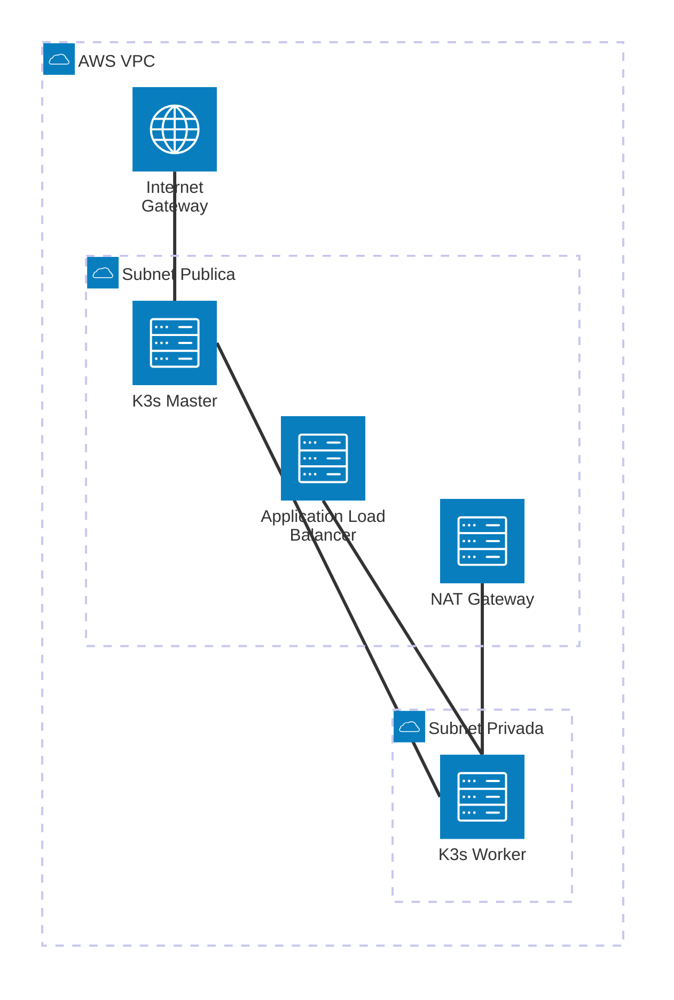

# Proyecto Seminario - Infraestructura AWS con Terraform

## Descripción
Infraestructura AWS diseñada con Terraform que implementa un clúster de **K3s** (Kubernetes ligero) en una VPC con subredes públicas y privadas distribuidas en múltiples zonas de disponibilidad.

## Diagrama de Arquitectura



*(Nota: El diagrama visualiza la conexión entre el Master en la red pública y los Workers en la red privada, protegidos por un NAT Gateway y expuestos vía ALB)*

## Arquitectura del Sistema
El proyecto implementa un clúster K3s con los siguientes roles:
- **K3s Master**: Ubicado en la subred pública para permitir la administración y comunicación con el clúster.
- **K3s Worker**: Ubicado en la subred privada, donde se ejecutan las cargas de trabajo de forma segura.
- **Load Balancer (ALB)**: Expone las aplicaciones ejecutadas en los nodos trabajadores hacia Internet.

## Arquitectura de Red

### VPC
- **CIDR Block**: `192.168.1.0/24`
- **Región**: `us-east-1`
- **DNS Hostname**: Habilitado
- **DNS Support**: Habilitado

### Subredes

#### Subredes Públicas
| Nombre | CIDR | AZ | Rango IP |
|--------|------|-------|----------|
| SubnetPublica-1 | 192.168.1.0/26 | us-east-1a | 192.168.1.0 - 192.168.1.63 |
| SubnetPublica-2 | 192.168.1.64/26 | us-east-1b | 192.168.1.64 - 192.168.1.127 |

#### Subredes Privadas
| Nombre | CIDR | AZ | Rango IP |
|--------|------|-------|----------|
| SubnetPrivada-1 | 192.168.1.128/26 | us-east-1a | 192.168.1.128 - 192.168.1.191 |
| SubnetPrivada-2 | 192.168.1.192/26 | us-east-1b | 192.168.1.192 - 192.168.1.255 |

## Componentes de Red

### Internet Gateway (IGW)
- Permite la comunicación entre la VPC e Internet
- Asociado directamente a la VPC

### Tablas de Enrutamiento

#### Tabla de Rutas Pública
- **Destino**: `0.0.0.0/0` → Internet Gateway
- **Asociada a**: SubnetPublica-1, SubnetPublica-2
- **Propósito**: Permitir acceso bidireccional a Internet

#### Tabla de Rutas Privada
- **Sin ruta a Internet** (por defecto solo tráfico local VPC)
- **Asociada a**: SubnetPrivada-1, SubnetPrivada-2
- **Propósito**: Aislar recursos de acceso directo desde Internet

### NAT Gateway (Opcional)
Si deseas que las subredes privadas puedan salir a Internet:
- **Ubicación**: SubnetPublica-1
- **Elastic IP**: Asociada
- **Propósito**: Permitir tráfico saliente desde subredes privadas

## Estructura de Archivos

```
ProyectoSeminario/
├── main.tf                  # Recursos principales (VPC, subredes, IGW, rutas)
├── variables.tf             # Definición de variables
├── providers.tf             # Configuración de providers AWS
├── terraform.tfvars.example # Ejemplo de valores de variables
└── terraform.tfstate.d/     # Estados de Terraform por ambiente
    └── dev/
        └── terraform.tfstate
```

## Variables Principales

| Variable | Descripción | Valor por Defecto |
|----------|-------------|-------------------|
| `aws_region` | Región de AWS | `us-east-1` |
| `aws_profile` | Perfil de AWS CLI | `default` |
| `project_name` | Nombre del proyecto | `ProyectoSeminario` |
| `vpc_cidr` | CIDR block de la VPC | `192.168.1.0/24` |

## Uso

### Prerrequisitos
- Terraform instalado (v1.0+)
- AWS CLI configurado con credenciales
- Cuenta de AWS con permisos adecuados
- Crear el S3 para guardar la configuración
- Key Pairs (**testKey.pem** en mi caso)


## Flujo de Tráfico

### Subredes Públicas
```
Instancia EC2 (Subnet Pública) 
  → Route Table Pública 
  → Internet Gateway 
  → Internet
```
**Casos de uso**: Servidores web, balanceadores de carga, bastion hosts

### Subredes Privadas (sin NAT)
```
Instancia EC2 (Subnet Privada) 
  → Route Table Privada 
  → Solo tráfico interno VPC
```
**Casos de uso**: Bases de datos, servidores de aplicación backend

### Subredes Privadas (con NAT Gateway)
```
Instancia EC2 (Subnet Privada) 
  → Route Table Privada 
  → NAT Gateway 
  → Internet Gateway 
  → Internet (solo salida)
```
**Casos de uso**: Instancias que necesitan descargar actualizaciones o acceder a APIs externas


---
## Notas Importantes

1. **Alta Disponibilidad**: Las subredes están distribuidas en dos zonas de disponibilidad (us-east-1a y us-east-1d)

2. **Seguridad**: Las subredes privadas no tienen acceso directo desde Internet, solo las públicas

3. **CIDR /26**: Cada subred proporciona aproximadamente 59 IPs utilizables (64 - 5 reservadas por AWS)

4. **Costos**: El NAT Gateway tiene costos asociados por hora y por GB procesado

5. **Map Public IP**: Las subredes públicas asignan automáticamente IP pública a las instancias lanzadas


## Próximos Pasos

- [ ] Configurar Security Groups
- [ ] Implementar instancias EC2
- [ ] Configurar Load Balancers
- [ ] Implementar Auto Scaling Groups
- [ ] Configurar bases de datos RDS en subredes privadas
- [ ] Implementar monitoreo con CloudWatch

## Referencias

- [Terraform AWS Provider](https://registry.terraform.io/providers/hashicorp/aws/latest/docs)
- [AWS VPC Documentation](https://docs.aws.amazon.com/vpc/)
- [Terraform Best Practices](https://www.terraform.io/docs/cloud/guides/recommended-practices/)

## Autor
Instituto Tecnológico Metropolitano - ITM  
Especialización - Seminario II - Profundización
