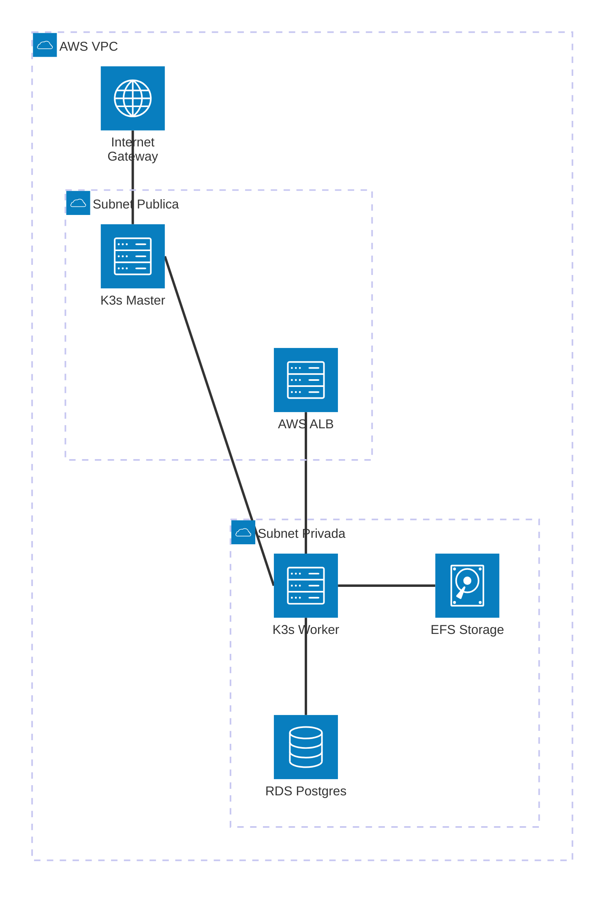

# Proyecto Seminario - Infraestructura AWS con Terraform: K3s, Persistence & n8n

## Descripción
Este proyecto implementa una arquitectura robusta en AWS utilizando Terraform, centrada en un clúster de **K3s** (Kubernetes ligero) con persistencia de datos externa y una implementación automatizada de **n8n**. La infraestructura está distribuida en subredes públicas y privadas para garantizar la seguridad y alta disponibilidad.

## Diagrama de Arquitectura



*(Nota: El K3s Master reside en la subred pública para gestión, mientras que los Workers, la base de datos RDS y el almacenamiento EFS se encuentran aislados en la subred privada)*

## Arquitectura del Sistema
El proyecto se divide en módulos funcionales:
- **01-K3S**: Despliega la red (VPC), seguridad y el clúster básico (Master y Worker).
- **02-PERSISTENCE**: Configura los servicios de datos externos:
    - **RDS (PostgreSQL)**: Base de datos para n8n.
    - **EFS (Elastic File System)**: Almacenamiento compartido para los nodos de K3s.
- **03-K3S-Storage**: Manifiestos de Kubernetes para configurar PV/PVC vinculados a EFS.
- **04-N8N**: Despliegue de n8n en el clúster usando los recursos de persistencia.

## Estructura del Proyecto

```
Seminario2/
├── 01-K3S/                  # Infraestructura base y clúster K3s
│   ├── modules/             # Red, cómputo, seguridad y LB
│   └── main.tf
├── 02-PERSISTENCE/          # Capa de datos (RDS + EFS)
│   ├── modules/             # db (RDS) y storage (EFS)
│   └── main.tf
├── 03-K3S-Storage/          # Configuración de Storage en K8s
│   └── pv-pvc-k3s.yaml
├── 04-N8N/                  # Despliegue de n8n (Deployment, Secret)
│   └── n8n-deployment.yaml
└── README.md
```

## Requisitos y Configuración

### Prerrequisitos
- **Terraform** v1.0+
- **AWS CLI** configurado
- Clave SSH (**testKey.pem**) en el directorio `01-K3S`
- Acceso a Internet para descargar las imágenes de n8n

### Pasos de Despliegue

1. **Infraestructura K3S**:
   - Navega a `01-K3S/`.
   - Ejecuta `terraform init` y `terraform apply`.
   - Obtén el IP del Master y el Token para configurar el clúster.

2. **Persistencia (RDS & EFS)**:
   - Navega a `02-PERSISTENCE/`.
   - Ejecuta `terraform init` y `terraform apply`.
   - Guarda el endpoint del RDS y el ID del EFS.

3. **Kubernetes Resources**:
   - Configura `kubectl` con el archivo `k3s.yaml` del master.
   - Aplica el almacenamiento: `kubectl apply -f 03-K3S-Storage/`.
   - Despliega n8n: `kubectl apply -f 04-N8N/`.

## Variables de Entorno y Seguridad
- Las contraseñas de DB y tokens de K3s se manejan preferiblemente mediante archivos `.tfvars` o variables de entorno locales.
- El ALB expone n8n en el puerto configurado (puerto 5678 por defecto).

---
**Autor**: Instituto Tecnológico Metropolitano - ITM  
**Materia**: Seminario II - Profundización
